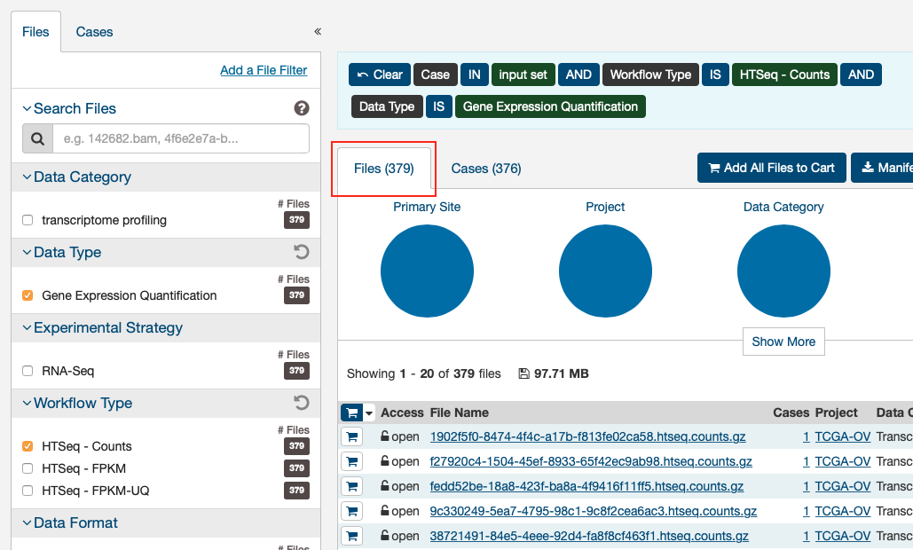

# About

UPDATE: reworked vignette on 2020-10-30. Vignette was last update 2020-10-27.

This notebook is for learning & testing the [`GenomicDataCommons`](https://bioconductor.org/packages/release/bioc/html/GenomicDataCommons.html) R Bioconductor package using the vignette ["The GenomicDataCommons Package"](https://bioconductor.org/packages/release/bioc/vignettes/GenomicDataCommons/inst/doc/overview.html#1_what_is_the_gdc) as a guide.

For reference, see [*Appendix A: Available Fields*](https://docs.gdc.cancer.gov/API/Users_Guide/Appendix_A_Available_Fields/) to know which fields are available for querying.

# Setup

```{r setup, results='hide'}
library(knitr)
library(tidyverse)
library(GenomicDataCommons)

# Set params
Sys.setenv(gdc_token_file = params$gdc_token_file) # Needs to be an environment variable to be read by gdc_token()

# set download dir
if (exists("dir_gdc_download_cache", where = params)) {
	gdc_set_cache(directory = params$dir_gdc_download_cache)
}
```

# VIGNETTE

# 1 What is the GDC?

# 2 Quickstart

This section shows basic functionality.

## 2.1 Installation

Install with:
```{r installation, eval=FALSE}
# if (!require("BiocManager"))
#     install.packages("BiocManager")
# BiocManager::install('GenomicDataCommons')
```

## 2.2 Check connectivity and status

Check required network activity:

```{r}
status()
```

Check status in code:

```{r}
stopifnot(status()$status == "OK")
```

## 2.3 Find data

This code builds a `manifest` file that can be used to download data from the GDC.

Example for querying raw counts genex filesusing HTSeq workflow:
```{r eg-make-manifest}
ge_manifest = files() %>%
	GenomicDataCommons::filter(x = ., expr = cases.project.project_id == "TCGA-OV") %>%
	GenomicDataCommons::filter(x = ., expr = type == "gene_expression") %>% 
	GenomicDataCommons::filter(x = ., expr = analysis.workflow_type == "HTSeq - Counts") %>%
	manifest()
ge_manifest
```

##2.4 Download data

***NOTE: change the `gdc_cache()` directory when actually downloading data. Set as param***

***NOTE: if data to download are controlled-access, you must set a functional token***

After the 379 gene expression files specified in the query above. Using multiple processes to do the download very significantly speeds up the transfer in many cases. On a standard 1Gb connection, the following completes in about 30 seconds. The first time the data are downloaded, R will ask to create a cache directory (see `?gdc_cache` for details of setting and interacting with the cache). Resulting downloaded files will be stored in the cache directory. Future access to the same files will be directly from the cache, alleviating multiple downloads.

Get the filenames from the manifest:
```{r get-filenames-from-manifest, results='hide'}
fnames = lapply(ge_manifest$id[1:20], gdcdata) ; fnames
```

## 2.5 Metadata queries

### 2.5.1 Clinical data

Accessing clinical data is a very common task. Given a set of `case_ids`, the `gdc_clinical()` function will return a list of four tibbles:

- demographic
- diagnoses
- exposures
- main

```{r clinical-data}
# get case UUIDs
case_ids = cases() %>%
	results(size = 10) %>%
	ids()
case_ids

# get clinical data
clindat = gdc_clinical(case_ids)
glimpse(clindat)
clindat # returns 4 tibbles
```

### 2.5.2 General metadata queries

The `GenomicDataCommons` package can access the significant clinical, demographic, biospecimen, and annotation information contained in the NCI GDC. The `gdc_clinical()` function will often be all that is needed, but the API and `GenomicDataCommons` package make much flexibility if fine-tuning is required.

```{r general-metadata}
expands = c("diagnoses", 
			"annotations", 
			"demographic", 
			"exposures")

clinResults = cases() %>%
	GenomicDataCommons::select(x = ., NULL) %>%
	GenomicDataCommons::expand(x = ., expands) %>%
	results(size = 50)
str(clinResults$id, list.len = 6)
```

# 3 Basic design

This package design is meant to have some similarities to the "hadleyverse" approach of dplyr. Roughly, the functionality for finding and accessing files and metadata can be divided into:

1.  Simple ***query*** constructors based on GDC API endpoints.
2.  A set of verbs that when applied, adjust ***filtering***, field ***selection***, and ***faceting*** (fields for aggregation) and result in a new query object (an endomorphism)
3.  A set of verbs that take a query and ***return results*** from the GDC

Here is an overview of functionality:

-   Creating a query:
    -   `projects()`
    -   `cases()`
    -   `files()`
    -   `annotations()`
-   Manipulating a query:
    -   `filter()`
    -   `facet()`
    -   `select()`
-   Introspection on the GDC API fields:
    -   `mapping()`
    -   `available_fields()`
    -   `default_fields()`
    -   `grep_fields()`
    -   `field_picker()`
    -   `available_values()`
    -   `available_expand()`
-   Executing an API call to retrieve query results
    -   `results()`
    -   `count()`
    -   `response()`
-   Raw data file downloads
    -   `gdcdata()`
    -   `transfer()`
    -   `gdc_client()`
-   Summarizing and aggregating field values (faceting)
    -   `aggregations()`
-   Authentication
    -   `gdc_token()`
-   BAM file slicing
    -   `slicing()`

# 4 Usage

Two main classes of operations when working with the GDC:

1.  ***Querying*** metadata and finding data files
2.  ***Transferring*** raw or processed data

## 4.1 Querying metadata

Vast amounts of metadata about cases (patients, basically), files, projects, and so-called annotations are available via the NCI GDC API. Typically, one will want to ***query*** metadata to either focus in on a set of files for download or transfer or to perform so-called ***aggregations*** (pivot-tables, facets, similar to the R `table()` functionality).

General steps for querying metadata:

1.  Create a "blank" query
2.  `filter` to limit results
3.  Retrieve results

In addition to fetching results, the GDC API allows faceting, or aggregating,, useful for compiling reports, generating dashboards, or building user interfaces to GDC data (see GDC web query interface for a non-R-based example).

The `GenomicDataCommons` has helper functions to for listing fields that are available for filtering.

### 4.1.1 Creating a query

A query of the GDC starts its life in R. Queries follow the four metadata endpoints available at the GDC. In particular, there are four convenience functions that each create GDCQuery objects (actually, specific subclasses of GDCQuery):

-   `projects()`
-   `cases()`
-   `files()`
-   `annotations()`

```{r make-query-object}
pquery = projects()
```

The pquery object is now an object of (S3) class, `GDCQuery` (and `gdc_projects` and `list`). The object contains the following elements:

- fields: This is a character vector of the fields that will be returned when we retrieve data. If no fields are specified to, for example, the `projects()` function, the default fields from the GDC are used (see `default_fields()`)
- filters: This will contain results after calling the `filter()` method and will be used to filter results on retrieval.
- facets: A character vector of field names that will be used for aggregating data in a call to `aggregations()`.
- archive: One of either “default” or “legacy”.
- token: A character(1) token from the GDC. See the authentication section for details, but note that, in general, the token is not necessary for metadata query and retrieval, **only for actual data download**.

Look at the structure of the query

```{r view-query-str}
class(pquery)
str(pquery)
```

### 4.1.2 Retrieving results

With a query object available, the next step is to retrieve results from the GDC. The GenomicDataCommons package. The most basic type of results we can get is a simple `count()` of records available that satisfy the filter criteria. Note that we have not set any filters, so a `count()` here will represent all the project records publicly available at the GDC in the “default” archive"

```{r get-query-counts}
pcount = GenomicDataCommons::count(pquery)
# or
pcount = pquery %>%
	GenomicDataCommons::count()
pcount
```

The `results()` method will fetch actual results:

```{r get-query-results}
presults = pquery %>% 
	results()
```

These results are returned from the GDC in **JSON format** and converted into a (***potentially nested***) list in R. The `str()` method is useful for taking a quick glimpse of the data.

```{r str-of-results}
str(presults)
```

A default of only 10 records are returned. You can use `size` and `from` arguments to `results()` to either page through results or to change the number of results. `results_all()` will simply fetch all the available results given a query. ***NOTE***: this may take a long time and return a ***huge*** results set if not used carefully. Use a combination of `counts()` and `results()` to estimate data size before using `results_all()`.

```{r length-of-default-results}
length(ids(presults))
```

```{r length-of-all-results}
presults = pquery %>% 
	results_all()
length(ids(presults))
```

```{r}
# includes all records
length(ids(presults)) == GenomicDataCommons::count(pquery)
```

Extracting subsets of results or manipulating the results into a more conventional R data structure is not easily generalizable. However, the `purrr`, `rlist`, and `data.tree` packages are all potentially of interest for ***manipulating complex, nested list structures.*** For viewing the results in an **interactive viewer**, consider the `listviewer` package.


### 4.1.3 Fields and values

[GDC fields documentation](https://docs.gdc.cancer.gov/API/Users_Guide/Search_and_Retrieval/#fields)

Central to querying and retrieving data is the ability to specify which fields to return, filtering by fields and values, and faceting or aggregating. The `GenomicDataCommons` package has two simple functions, `available_fields()` and `default_fields()`. ***Each can operate on a character endpoint name ("cases", "files", "annotations", or "projects")*** or a `GDCQuery` object

```{r}
default_fields("files")
```

The number of fields ***available*** for the "files" endpoint:

```{r}
length(available_fields("files"))
```

The first few fields available for the "files" endpoint:

```{r}
head(available_fields("files"))
```

The fields returned by a query can be specified following a similar paradigm to that of the `dplyr` package. The `select()` function is a verb that resets the fields slot of a `GDCQuery`. ***NOTE*** that this is not quite analagous to the dplyr `select()` verb that limits from already-present fields. We *completely* replace the fields when using `select()` on a `GDCQuery`.

```{r}
# default fields here
qcases = cases()
qcases$fields
```

Set up query to use *all* available fields. ***Note*** that checking of fields is done by `select()`.

```{r}
qcases = cases() %>% 
	GenomicDataCommons::select(available_fields("cases"))
head(qcases$fields)
```

Finding fields of interest is such a common operation that the GenomicDataCommons includes the `grep_fields()` function and the `field_picker()` [?doesn't exist?] widget. See the appropriate help pages for details.

```{r grep fields}
grep_fields(entity = "files", pattern = "tissue")
```

### 4.1.4 Facets and aggregation

[GDC `facet` documentation](https://docs.gdc.cancer.gov/API/Users_Guide/Search_and_Retrieval/#facets)

The GDC API offers a feature known as **aggregation** or **faceting.** By specifying one or more fields (of appropriate type), the GDC can return to us a count of the number of records matching each potential value. This is similar to the R `table` method. Multiple fields can be returned at once, but the GDC API does not have a cross-tabulation feature; all aggregations are only on *one field at a time.* Results of `aggregation()` calls come back as a list of `data.frames` (actually, `tibbles`).

```{r}
# total number of files of a specific type
res = files() %>% 
	# names of fields to facet by
	facet(c("type", "data_type")) %>%
	aggregations()
res$type
res$data_type
```

`aggregations()` is an easy way to learn the contents of individual fields and forms the basis for faceted search pages.

### 4.1.5 Filtering

[GDC filtering documentation](https://docs.gdc.cancer.gov/API/Users_Guide/Search_and_Retrieval/#filters-specifying-the-query)

The GenomicDataCommons package uses a form of non-standard evaluation to specify R-like queries that are then translated into an R list. That R list is, upon calling a method that fetches results from the GDC API, translated into the appropriate JSON string. The R expression uses the formula interface as suggested by Hadley Wickham in his [vignette on non-standard evaluation](http://adv-r.had.co.nz/Computing-on-the-language.html).

> It’s best to use a formula because a formula captures both the expression to evaluate and the environment where the evaluation occurs. This is important if the expression is a mixture of variables in a data frame and objects in the local environment [for example].

For the user, these details will not be too important except to note that a filter expression must begin with a “~”.

```{r}
qfiles = files()

# count all files
qfiles %>%
	count()
```


To limit the file type, we can refer back to the section on faceting to see the possible values for the field "type". For example, to filter file results to only "gene_expression" files, we simply specify a filter:

```{r}
qfiles = files() %>% 
	filter(type == "gene_expression")
# here is what the filter looks like after translation
str(get_filter(qfiles))
```

What if we want to create a filter based on e.g. the project 'TCGA-OVCA'? There are a few possible ways.

The first is based on R functionality with some intuition:

```{r}
grep(pattern = "pro", 
	 x = available_fields("files"), 
	 value = T) %>% 
	head()
```

Interestingly, project information is nested inside the case. We don't need to know that detail other than to know that we now have a few potential guesses for where our information might be in the files records. We need to know where because we need to construct the appropriate filter.

```{r}
# see how many files are in each project
files() %>% 
	facet("cases.project.project_id") %>% 
	aggregations() %>% 
	head()
```

We note that `cases.project.project_id` looks like it is a good fit. We also note that `TCGA-OV` is the correct `project_id`, not `TCGA-OVCA`. Note that unlike with `dplyr` and friends, the `filter()` method here replaces the filter and **does not build on any previous filters.**


```{r}
# add filters
qfiles = files() %>%
	filter(cases.project.project_id == "TCGA-OV" & 
		   	type == "gene_expression")

# show the filters
str(get_filter(qfiles))
```

```{r count filtered files 2}
qfiles %>%
	count()
```

Asking for a `count()` of results given these new filter criteria gives `r qfiles %>% count()` results. Filters can be chained (or nested) to accomplish the same effect as multiple & conditionals. The count() below is equivalent to the & filtering done above.

```{r count filtered files}
qfiles2 = files() %>%
	filter(cases.project.project_id == "TCGA-OV") %>%
	filter(type == "gene_expression")
qfiles2 %>%
	count()
```

```{r are counts equivalent}
(qfiles %>% count()) == (qfiles2 %>% count())
```

Generating a manifest for bulk downloads is as simple as asking for the ***manifest from the current query***:

```{r}
manifest_df = qfiles %>% manifest()
manifest_df
```

**Note** you might still not be there -- looking at filenames, there are suspiciously named files that might include "FPKM", "FPKM-UQ", or "counts". Another round of `grep()` and `available_fields()` looking for "type" turned up that the field "`analysis.workflow_type`" has the appropriate filter criteria.

```{r}
qfiles = files() %>% 
	filter(~ cases.project.project_id == "TCGA-OV" & 
		   	 type == "gene_expression" & 
		   	 analysis.workflow_type == "HTSeq - Counts")

manifest_df = qfiles %>% manifest()
nrow(manifest_df) # SAME as in GDC portal
```



The GDC Data Transfer Tool can be used (from R, `transfer()` or from the command line) to orchestrate high-performance, restartable transfers of all the files in the manifest. See the [bulk downloads](#bulk-downloads) section for details.

## 4.2 Authentication

[GDC authentication documentation](https://docs.gdc.cancer.gov/API/Users_Guide/Search_and_Retrieval/#facets)

The GDC offers both "controlled-access" and "open" data. As of this writing, only data stored as files is "controlled-access"; that is, metadata accessible via the GDC is all "open" data and some files are "open" and some are "controlled-access". Controlled-access data are only available after going through [the process of obtaining access.](https://gdc.cancer.gov/access-data/obtaining-access-controlled-data)

After controlled-access to one or more datasets has been granted, logging into the GDC web portal will allow you to access a GDC authentication token, which can be downloaded and then used to access available controlled-access data via the `GenomicDataCommons` package.

The `GenomicDataCommons` uses authentication tokens only for downloading data (see `transfer()` and `gdcdata()` documentation). The package includes a helper function, `gdc_token()`, that looks for the token to be stored in one of three ways (resolved in this order):

1.  As a string stored in the environment variable, GDC_TOKEN
2.  As a file, stored in the file named by the environment variable, GDC_TOKEN_FILE
3.  In a file in the user home directory, called .gdc_token

As a concrete example:

```{r, eval=FALSE}
token = gdc_token()
transfer(..., token = token)
# or
transfer(..., token = get_token())
```

## 4.3 Datafile access and download

### 4.3.1 Data downloads via the GDC API

The `gdcdata()` function takes a character vector of one or more file ids. A simple way of producing such a vector is to produce a `manifest()` data frame and then pass in the first column, which will contain file ids.

```{r}
# get filenames
fnames = gdcdata(manifest_df$id[1:2])
fnames
```

Note that for controlled-access data, a GDC authentication token is required. Using the `BiocParallel` package may be useful for ***downloading in parallel***, particularly for large numbers of smallish files.

### 4.3.2 Bulk downloads

The bulk download functionality is *only efficient* (as of v1.2.0 of the GDC Data Transfer Tool) for *relatively large files*, so use this approach only when transferring BAM files or larger VCF files, for example. Otherwise, consider using the approach shown above, perhaps in parallel.

```{r}
# FIXME: Error in gdc_client() : gdc_client not found
fnames = gdcdata(manifest_df$id[3:10], access_method = "client") ; fnames
```

### 4.3.3 BAM slicing

[TBD]

# 5 Use Cases

## 5.1 Cases

### 5.1.1 How many cases are there per project_id?

Find how many cases per project

```{r}
res = cases() %>% 
	facet("project.project_id") %>% 
	aggregations()
res
```

Plot the results

```{r}
res$project.project_id %>%
ggplot(aes(x = factor(key, levels = key), 
		   y = doc_count)) + 
	geom_bar(stat = "identity") + 
	# coord_flip() +
	theme_light() + 
	theme(axis.text.x = element_text(angle = 90)) +
	labs(x = "Project", 
		 title = "Number of Cases per GDC Project", 
		 y = NULL)
```

### 5.1.2 How many cases are included in all TARGET projects?

```{r num cases in TARGET}
cases() %>% 
	filter(~ project.program.name == "TARGET") %>% 
	count()
```

### 5.1.3 How many cases are included in all TCGA projects?

```{r num cases in TCGA}
cases() %>% 
	filter(~ project.program.name == "TCGA") %>%
	count()
```

### 5.1.4 What is the breakdown of sample types in TCGA-BRCA?

```{r sample types in tcga-brca}
# # The need to do the "&" here is a requirement of the
# # current version of the GDC API. I have filed a feature
# # request to remove this requirement.
# resp = cases() %>% filter(~ project.project_id=='TCGA-BRCA' &
#                               project.project_id=='TCGA-BRCA' ) %>%
#     facet('samples.sample_type') %>%
# 	aggregations()
# resp$samples.sample_type

# this seems to do the same thing and works fine
resp = cases() %>%
	filter(project.project_id == "TCGA-BRCA") %>%
	facet("samples.sample_type") %>% 
	aggregations()
resp
```

### 5.1.5 Fetch all samples in TCGA-BRCA that use "Solid Tissue" as a normal

```{r fetch all brca samples w solid tissue normal}
# # The need to do the "&" here is a requirement of the
# # current version of the GDC API. I have filed a feature
# # request to remove this requirement.
# resp = cases() %>% filter(~ project.project_id=='TCGA-BRCA' &
#                               samples.sample_type=='Solid Tissue Normal') %>%
#     GenomicDataCommons::select(c(default_fields(cases()),'samples.sample_type')) %>%
#     response_all()
# count(resp)

resp = cases() %>%
	filter(~ project.project_id == "TCGA-BRCA" & 
		   	samples.sample_type == "Solid Tissue Normal") %>%
	# filter(project.project_id == "TCGA-BRCA") %>%
	# filter(SAMPLES.SAMPLE_TYPE == "Solid Tissue Normal") %>%
	select(c(default_fields(cases()), 
			 "samples.sample_type")) %>% 
	response_all()
resp %>%
	count()
```

View results from query

```{r view results}
# res = resp %>% 
# 	results()
# str(res[["disease_type"]], list.len = 6)
res = resp %>% 
	results_all()
str(res[["disease_type"]])
```

look at the IDs (UUIDs) of the samples in the object:

```{r look at file ids}
resp %>%
	ids() %>%
	head()
```

## 5.2 Files

### 5.2.1 How many of each type of file are available?

```{r}
res = files() %>% 
	facet("type") %>%
	aggregations() # shows counts by "type" facet - `count()` removes
	# count() # removes "type" facet and turns into atomic
res$type
```

plot the results

```{r plot file types}
res$type %>%
	ggplot(aes(x = reorder(key, doc_count), 
			   y = doc_count)) +
	geom_bar(stat = "identity") +
	theme_classic() +
	coord_flip() +
	theme(
		axis.text.x = element_text(angle = 90)
	) +
	labs(
		title = "Number of files per File Type",
		x = "File Type", 
		y = NULL
	)


# res_df = data.frame(res$type)
# res_df$key = factor(res_df$key, levels = res_df$key)
# 	# OR
# # ggplot(res_df, aes(x = factor(key, levels = key), y = doc_count)) + 
# ggplot(res_df, aes(x = key, y = doc_count)) + 
# 	geom_bar(stat = "identity") + 
# 	theme_light() + 
# 	theme(axis.text.x = element_text(angle = 60, hjust = 1))
```

### 5.2.2 Find gene-level RNA-seq quantification files for GBM

```{r gene-level rnaseq quant files gbm}
# make query (WRONG WAY! -->)
q = files() %>%
	select(available_fields("files")) %>%
	filter(~ cases.project.project_id == "TCGA-GBM" &
		   	data_type == "Gene Expression Quantification")
q

# facet & aggregate results
q_aggr = q %>%
	facet("analysis.workflow_type") %>%
	aggregations()
q_aggr

# so need to add another filter
file_ids = q %>% filter(~ cases.project.project_id=='TCGA-GBM' &
                            data_type=='Gene Expression Quantification' &
                            analysis.workflow_type == 'HTSeq - Counts') %>%
	aggregations()
	
    GenomicDataCommons::select('file_id') %>%
    response_all() %>%
    ids()
file_ids
```

from tut:

```{r}
q = files() %>%
    GenomicDataCommons::select(available_fields('files')) %>%
    filter(~ cases.project.project_id=='TCGA-GBM' &
               data_type=='Gene Expression Quantification')
q %>% facet('analysis.workflow_type') %>% aggregations()
```

```{r}
# so need to add another filter
file_ids = q %>% filter(~ cases.project.project_id=='TCGA-GBM' &
                            data_type=='Gene Expression Quantification' &
                            analysis.workflow_type == 'HTSeq - Counts') %>%
    GenomicDataCommons::select('file_id') %>%
    response_all() %>%
    ids()
file_ids
```
